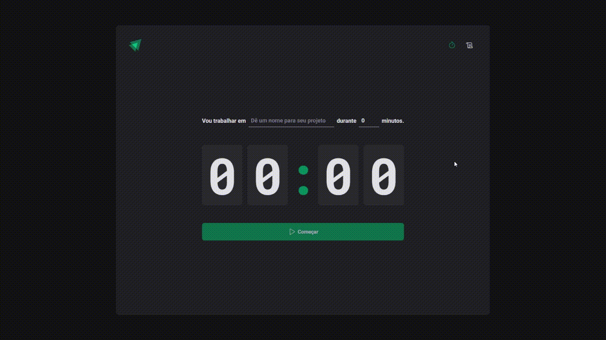

<h1 align="center">
  Ignite Timer
</h1>

<h4 align="center">
  Aplicação de Pomodoro para trabalho ou estudo. O usuário pode definir um timer que ele quer ficar focado em sua tarefa, e também ver o histórico de ciclos já feitos.
</h4>

 

    

#

## 📚 Tecnologias
- Immer
- React Hook Form
- React Router
- Styled Components
- Zod